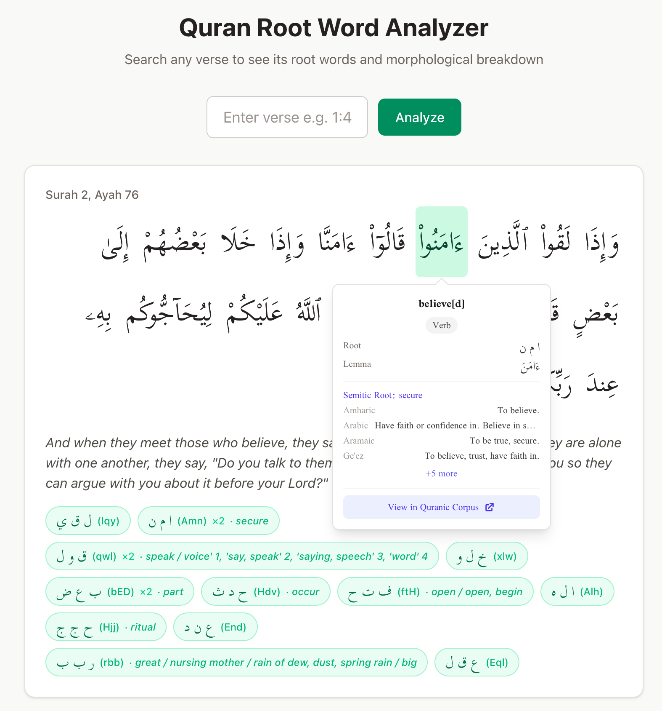

# Quran Root Word Analyzer

An interactive tool for exploring the morphology and Semitic etymology of every word in the Quran. Search any verse to see its Arabic root words, grammatical breakdown, word-by-word translations, and cognate data across 59 Semitic languages — from Akkadian and Hebrew to Ge'ez and Mehri.



## Features

- **Interactive Arabic text** — hover or click any word to see its translation, part of speech, root, and lemma
- **Root word highlighting** — click a root tag to highlight every word in the verse that shares that root
- **Full morphological analysis** — gender, number, person, case, voice, mood, verb form, and state for each word segment
- **Semitic cognate panel** — expand any root to see its reflexes across Semitic languages with meanings and etymological notes
- **Word-by-word English glosses** — fetched from the Quran.com API and cached locally
- **Corpus links** — each root links directly to the [Quranic Arabic Corpus](https://corpus.quran.com) dictionary entry

## Data at a Glance

| Metric | Count |
|--------|-------|
| Quranic verses | 6,236 |
| Morphology segments | 128,219 |
| Unique Arabic roots | 1,642 |
| Semitic etymology entries | 3,516 |
| Language attestations | 14,671 across 59 languages |
| Cognate coverage | 849 / 1,642 roots (51.7%) |

Cognate data is sourced from two databases:
- **[SemiticRoots.net](http://www.semiticroots.net)** — 812 curated Proto-Semitic roots with derivatives
- **[Starling / Tower of Babel](https://starlingdb.org)** — 2,704 additional etymological records from S. Starostin's database

---

## Quick Start

### Prerequisites

- Python 3.10+
- Node.js 18+ and npm

### 1. Clone the repository

```bash
git clone https://github.com/YOUR_USERNAME/quran-related.git
cd quran-related
```

### 2. Set up the backend

```bash
cd roots/backend

# Create a virtual environment (recommended)
python3 -m venv venv
source venv/bin/activate   # on Windows: venv\Scripts\activate

# Install Python dependencies
pip install -r requirements.txt
```

### 3. Set up the database

You have two options:

#### Option A: Use the pre-built database (fastest)

Copy the included database from the `assets` folder:

```bash
mkdir -p data
cp ../../assets/quran.db data/quran.db
```

This database already includes all Quranic text, morphology, translations, and Semitic cognate data. You're ready to go.

#### Option B: Build from scratch

If you prefer to build the database yourself from the original sources:

```bash
# Step 1: Download Quranic data and create the base database
python seed_db.py

# Step 2: Scrape Semitic cognate data from semiticroots.net (~5 min)
python scrape_semitic_roots.py

# Step 3: Scrape Starling etymology database (~5-10 min, 147 pages)
python scrape_starling.py
```

Each scraper caches its results as JSON (`data/semitic_roots.json`, `data/starling_semitic.json`), so subsequent runs skip the scraping step and import directly from cache. Use `--force` to re-scrape.

### 4. Start the backend server

```bash
python app.py
```

The Flask API will start on `http://localhost:5000`.

### 5. Set up and start the frontend

In a new terminal:

```bash
cd roots/frontend

# Install Node dependencies
npm install

# Start the development server
npm run dev
```

The Vite dev server will start on `http://localhost:5173` with API requests proxied to the Flask backend.

### 6. Open the app

Navigate to **http://localhost:5173** in your browser. Try searching for a verse like `1:1`, `2:255`, or `112:1`.

---

## Project Structure

```
quran-related/
├── assets/
│   ├── quran.db                        # Pre-built SQLite database (ready to use)
│   └── screenshot-frontend.png         # Screenshot for README
├── roots/
│   ├── backend/
│   │   ├── app.py                      # Flask API server
│   │   ├── seed_db.py                  # Database builder (downloads Quranic data)
│   │   ├── buckwalter.py               # Buckwalter ↔ Arabic transliteration
│   │   ├── scrape_semitic_roots.py     # Scraper for semiticroots.net
│   │   ├── scrape_starling.py          # Scraper for Starling/Tower of Babel DB
│   │   ├── requirements.txt            # Python dependencies
│   │   └── data/                       # SQLite database and cached data files
│   └── frontend/
│       ├── src/
│       │   ├── App.tsx                 # Main React component
│       │   ├── types/index.ts          # TypeScript type definitions
│       │   ├── api/quran.ts            # API client
│       │   └── components/
│       │       ├── VerseDisplay.tsx     # Interactive verse view with word highlighting
│       │       ├── WordTooltip.tsx      # Word popup with morphology and corpus link
│       │       ├── CognatePanel.tsx     # Semitic cognates table
│       │       ├── SearchBar.tsx        # Verse search input
│       │       ├── WordBreakdown.tsx    # Word-by-word morphology grid
│       │       └── MorphologyCard.tsx   # Single word morphology card
│       ├── package.json
│       └── vite.config.ts              # Vite config with API proxy
└── README.md
```

---

## API Reference

The Flask backend exposes three endpoints:

### `GET /api/verse/<surah>:<ayah>`

Returns comprehensive verse data including Arabic text, English translation, word-by-word morphology, and Semitic cognates for each root.

**Example:** `/api/verse/1:1`

```json
{
  "surah": 1,
  "ayah": 1,
  "text_uthmani": "بِسْمِ ٱللَّهِ ٱلرَّحْمَـٰنِ ٱلرَّحِيمِ",
  "translation": "In the name of Allah, the Entirely Merciful, the Especially Merciful.",
  "words": [
    {
      "position": 1,
      "translation": "(In) the name",
      "segments": [
        {
          "form_arabic": "بِ",
          "pos": "Preposition",
          "root_arabic": "",
          "root_buckwalter": "",
          "features": {}
        },
        {
          "form_arabic": "سْمِ",
          "pos": "Noun",
          "root_arabic": "س م و",
          "root_buckwalter": "smw",
          "features": { "case": "Genitive", "gender": "Masculine", "number": "Singular" }
        }
      ]
    }
  ],
  "roots_summary": [
    {
      "root_arabic": "س م و",
      "root_buckwalter": "smw",
      "occurrences": 1,
      "cognate": {
        "transliteration": "s¹-m-w",
        "concept": "name / sky",
        "derivatives": [ ... ]
      }
    }
  ]
}
```

### `GET /api/cognates/<root_buckwalter>`

Returns Semitic cognate data for a specific root.

**Example:** `/api/cognates/Hmd` returns cognates for the root ح م د (praise).

### `GET /api/surahs`

Returns the list of all 114 surahs with English names and verse counts.

---

## Database Schema

The SQLite database (`quran.db`) contains six tables:

| Table | Description |
|-------|-------------|
| `verses` | Quranic text in Uthmani script (6,236 rows) |
| `translations` | English translation — Sahih International (6,236 rows) |
| `morphology` | Full morphological analysis of every word segment (128,219 rows) |
| `word_glosses` | Cached word-by-word English translations from Quran.com API |
| `semitic_roots` | Proto-Semitic etymological roots with `source` column (3,516 rows) |
| `semitic_derivatives` | Language attestations for each root (14,671 rows) |

The `semitic_roots` table has a `source` column (`'semiticroots'` or `'starling'`) so both data sources coexist without conflicts. Root IDs from Starling start at 10001 to avoid collisions.

---

## Data Sources

| Source | What it provides | How it's fetched |
|--------|------------------|------------------|
| [Quranic Arabic Corpus](https://corpus.quran.com/) | Morphological analysis (POS, root, lemma, features) | `seed_db.py` downloads from GitHub |
| [Tanzil.net](https://tanzil.net/) | Uthmani Arabic text | `seed_db.py` downloads text file |
| [Al Quran Cloud API](https://alquran.cloud/) | Sahih International English translation | `seed_db.py` downloads JSON |
| [Quran.com API v4](https://api.quran.com/) | Word-by-word English glosses | `app.py` fetches on demand and caches |
| [SemiticRoots.net](http://www.semiticroots.net/) | 812 Proto-Semitic roots with derivatives | `scrape_semitic_roots.py` |
| [Starling DB](https://starlingdb.org/) | 2,704 Semitic etymology records across ~20 languages | `scrape_starling.py` |

---

## Tech Stack

**Backend**
- Python 3.10+ with Flask
- SQLite for data storage
- BeautifulSoup for web scraping

**Frontend**
- React 19 with TypeScript
- Tailwind CSS v4
- Vite 7 for development and bundling

---

## Re-scraping Cognate Data

Both scrapers are non-destructive — running one will not delete data from the other:

```bash
# Re-scrape semiticroots.net (replaces only semiticroots data)
python scrape_semitic_roots.py --force

# Re-scrape Starling DB (replaces only starling data)
python scrape_starling.py --force
```

Without `--force`, the scrapers use their cached JSON files and only re-import into SQLite.

---

## License

This project is for educational and research purposes. Quranic text and morphological data are sourced from open community projects. Semitic etymological data is scraped from publicly accessible academic databases.

---

## Acknowledgments

- [Quranic Arabic Corpus](https://corpus.quran.com/) by Kais Dukes — morphological annotations
- [SemiticRoots.net](http://www.semiticroots.net/) — curated Proto-Semitic root database
- [The Tower of Babel / Starling](https://starlingdb.org/) — S. Starostin's etymological database
- [Tanzil.net](https://tanzil.net/) — Quranic text in multiple scripts
- [Quran.com](https://quran.com/) — word-by-word translations API
