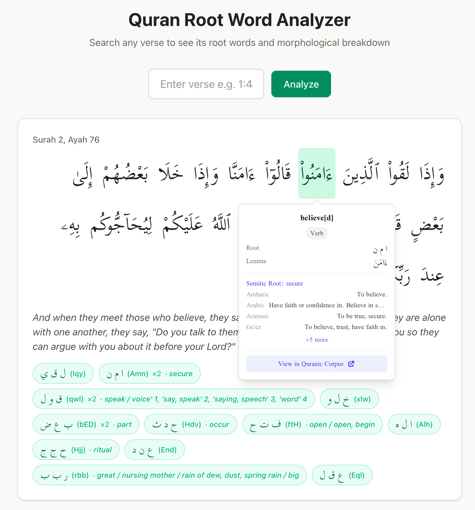

# Quran Root Word Analyzer

An interactive tool for exploring the morphology and Semitic etymology of every word in the Quran. Search any verse to see its Arabic root words, grammatical breakdown, word-by-word translations, and cognate data across 59 Semitic languages — from Akkadian and Hebrew to Ge'ez and Mehri.



## Features

- **Interactive Arabic text** — hover or click any word to see its translation, part of speech, root, and lemma
- **Multi-word selection** — click multiple words to select them (emerald highlight + ring); click again to deselect
- **Cross-verse word search** — select words and/or root pills, then search the entire Quran for verses containing all of them. Result count updates live as you select. Matched words are highlighted in yellow in the results.
- **Root-based search** — click root pills at the bottom of a verse to add roots to your search query alongside individual words
- **Root detail page** — select a single root to see "Analyze this Root", which opens a dedicated page (`/root/<buckwalter>`) showing all lemmas derived from that root, the full Semitic cognate table, and sample verses with highlighted occurrences and word-hover tooltips
- **Related verses** — IDF-weighted similarity engine automatically finds verses that share the most roots and lemmas with the current verse, ranked by containment score
- **Surrounding context** — view the verses before and after the current verse for context, with click-to-navigate
- **Full morphological analysis** — gender, number, person, case, voice, mood, verb form, and state for each word segment
- **Semitic cognate panel** — expand any root to see its reflexes across Semitic languages with meanings and etymological notes
- **Word-by-word English glosses** — fetched from the Quran.com API and cached locally
- **AI-powered translation** — experimental translation engine that derives meaning exclusively from Quranic cross-references, Semitic cognates, and morphological data via a local LLM (Ollama) or OpenAI. Translations appear in a violet panel when available.
- **AI word meanings** — per-word AI meanings with cross-references, cognates, and morphological context. Displayed as a violet "AI" badge in tooltips. Uses Zipf-optimized frequency tiers so high-frequency lemmas are translated once and reused.
- **Translation judge** — LLM-based arbiter that compares conventional (Quran.com) and AI word glosses and picks the best tooltip label using a three-tier Zipf strategy. Writes the winner back to the database as `preferred_translation`.
- **Corpus links** — each root links directly to the [Quranic Arabic Corpus](https://corpus.quran.com) dictionary entry
- **Chrome extension** — content script injects word-hover tooltips directly on quran.com pages, plus a popup showing related verses for the current page

## Data at a Glance

| Metric | Count |
|--------|-------|
| Quranic verses | 6,236 |
| Morphology segments | 128,219 |
| Unique Arabic roots | 1,642 |
| Unique lemmas | 4,832 |
| Unique word forms | 12,204 |
| Semitic etymology entries | 3,516 |
| Language attestations | 14,671 across 59 languages |
| Cognate coverage | 849 / 1,642 roots (51.7%) |

Cognate data is sourced from two databases:
- **[SemiticRoots.net](http://www.semiticroots.net)** — 812 curated Proto-Semitic roots with derivatives
- **[Starling / Tower of Babel](https://starlingdb.org)** — 2,704 additional etymological records from S. Starostin's database

---

## Quick Start

### Prerequisites

- Python 3.10+
- Node.js 18+ and npm

### 1. Clone the repository

```bash
git clone https://github.com/YOUR_USERNAME/quran-related.git
cd quran-related
```

### 2. Set up the backend

```bash
cd roots/backend

# Create a virtual environment (recommended)
python3 -m venv venv
source venv/bin/activate   # on Windows: venv\Scripts\activate

# Install Python dependencies
pip install -r requirements.txt
```

### 3. Set up the database

You have two options:

#### Option A: Use the pre-built database (fastest)

Copy the included database from the `assets` folder:

```bash
mkdir -p data
cp ../../assets/quran.db data/quran.db
```

This database already includes all Quranic text, morphology, translations, and Semitic cognate data. You're ready to go.

#### Option B: Build from scratch

If you prefer to build the database yourself from the original sources:

```bash
# Step 1: Download Quranic data and create the base database
python seed_db.py

# Step 2: Scrape Semitic cognate data from semiticroots.net (~5 min)
python scrape_semitic_roots.py

# Step 3: Scrape Starling etymology database (~5-10 min, 147 pages)
python scrape_starling.py
```

Each scraper caches its results as JSON (`data/semitic_roots.json`, `data/starling_semitic.json`), so subsequent runs skip the scraping step and import directly from cache. Use `--force` to re-scrape.

### 4. Start the backend server

```bash
python app.py
```

The Flask API will start on `http://localhost:5000`.

### 5. Set up and start the frontend

In a new terminal:

```bash
cd roots/frontend

# Install Node dependencies
npm install

# Start the development server
npm run dev
```

The Vite dev server will start on `http://localhost:4000` with API requests proxied to the Flask backend.

### 6. Open the app

Navigate to **http://localhost:4000** in your browser. Try searching for a verse like `1:1`, `2:255`, or `112:1`.

### 7. (Optional) Build and load the Chrome extension

```bash
cd extensions/quran-research-tool

# Install dependencies
npm install

# Build the extension
npm run build
```

Then load the extension in Chrome:
1. Open `chrome://extensions`
2. Enable "Developer mode"
3. Click "Load unpacked" and select the `extensions/quran-research-tool/dist/` folder

The extension adds two features:
- **Content script on quran.com** — hover over any Arabic word to see a tooltip with translation, POS, root, lemma, and Semitic cognates. Click a word to pin the tooltip. The "+N more" cognate link opens the root detail page on your local frontend.
- **Popup** — click the extension icon while on a quran.com verse page to see related verses.

> **Note:** The extension requires the Flask backend running on `localhost:5000` (for API calls) and the frontend on `localhost:4000` (for root detail page links).

---

## Project Structure

```
quran-related/
├── assets/
│   ├── quran.db                        # Pre-built SQLite database (ready to use)
│   └── screenshot-frontend.png         # Screenshot for README
├── roots/
│   ├── backend/
│   │   ├── app.py                      # Flask API server + similarity engine
│   │   ├── seed_db.py                  # Database builder (downloads Quranic data)
│   │   ├── buckwalter.py               # Buckwalter ↔ Arabic transliteration
│   │   ├── scrape_semitic_roots.py     # Scraper for semiticroots.net
│   │   ├── scrape_starling.py          # Scraper for Starling/Tower of Babel DB
│   │   ├── translate_ai.py            # AI verse translation pipeline (Ollama / OpenAI)
│   │   ├── translate_ai_batch.py      # Batch API variant (50% cheaper — prepare/submit/download)
│   │   ├── word_meanings_ai.py        # AI per-word meanings pipeline (Zipf-tiered)
│   │   ├── word_meanings_ai_batch.py  # Batch API variant for word meanings
│   │   ├── judge_translations.py      # LLM judge: picks best tooltip gloss
│   │   ├── judge_translations_batch.py # Batch API variant for judge
│   │   ├── run_all_verses.sh          # Shell runner: translate full Quran, auto-resumes
│   │   ├── run_all_words.sh           # Shell runner: process all words, auto-resumes
│   │   ├── requirements.txt           # Python dependencies
│   │   └── data/                      # SQLite database and cached data files
│   └── frontend/
│       ├── src/
│       │   ├── App.tsx                 # Main React component with path routing
│       │   ├── types/index.ts          # TypeScript type definitions
│       │   ├── api/quran.ts            # API client (verse, root, related, context, search)
│       │   └── components/
│       │       ├── VerseDisplay.tsx     # Interactive verse with multi-word selection
│       │       ├── SelectionHeader.tsx  # Selected words/roots bar with live count
│       │       ├── RootPage.tsx         # Root detail page (/root/<bw>)
│       │       ├── WordAnalysisPage.tsx # Word detail page (/word/<surah>:<ayah>/<pos>)
│       │       ├── WordSearchResults.tsx # Cross-verse search results with highlighting
│       │       ├── RelatedVerses.tsx    # IDF-ranked related verses
│       │       ├── SurroundingContext.tsx # Adjacent verses for context
│       │       ├── WordTooltip.tsx      # Word popup with morphology, AI badge, corpus link
│       │       ├── CognatePanel.tsx     # Semitic cognates table
│       │       ├── SearchBar.tsx        # Verse search input
│       │       ├── WordBreakdown.tsx    # Word-by-word morphology grid
│       │       ├── MorphologyCard.tsx   # Single word morphology card
│       │       └── AITranslation.tsx   # AI translation display panel (violet)
│       ├── package.json
│       └── vite.config.ts              # Vite config with API proxy (port 4000)
├── extensions/
│   └── quran-research-tool/
│       ├── public/
│       │   ├── manifest.json           # Chrome extension manifest v3
│       │   └── icons/                  # Extension icons
│       ├── src/
│       │   ├── content/
│       │   │   ├── content.ts          # Content script for quran.com word tooltips
│       │   │   └── content.css         # Tooltip styles (.qrt- prefixed)
│       │   ├── popup/                  # Extension popup (related verses)
│       │   ├── components/             # Shared React components for popup
│       │   ├── api/                    # API client for popup
│       │   └── types/                  # TypeScript types for popup
│       ├── vite.config.ts              # Main Vite config (popup build)
│       ├── vite.content.config.ts      # Content script build (IIFE output)
│       └── package.json
└── README.md
```

---

## API Reference

The Flask backend exposes ten endpoints:

### `GET /api/verse/<surah>:<ayah>`

Returns comprehensive verse data including Arabic text, English translation, word-by-word morphology, and Semitic cognates for each root.

**Example:** `/api/verse/1:1`

```json
{
  "surah": 1,
  "ayah": 1,
  "text_uthmani": "بِسْمِ ٱللَّهِ ٱلرَّحْمَـٰنِ ٱلرَّحِيمِ",
  "translation": "In the name of Allah, the Entirely Merciful, the Especially Merciful.",
  "words": [
    {
      "position": 1,
      "translation": "(In) the name",
      "segments": [
        {
          "form_arabic": "بِ",
          "pos": "Preposition",
          "root_arabic": "",
          "root_buckwalter": "",
          "features": {}
        },
        {
          "form_arabic": "سْمِ",
          "pos": "Noun",
          "root_arabic": "س م و",
          "root_buckwalter": "smw",
          "features": { "case": "Genitive", "gender": "Masculine", "number": "Singular" }
        }
      ]
    }
  ],
  "roots_summary": [
    {
      "root_arabic": "س م و",
      "root_buckwalter": "smw",
      "occurrences": 1,
      "cognate": {
        "transliteration": "s¹-m-w",
        "concept": "name / sky",
        "derivatives": [ ... ]
      }
    }
  ]
}
```

### `GET /api/related/<surah>:<ayah>`

Finds verses most related to the given verse using IDF-weighted lemma/root containment scoring. Returns up to 25 results ranked by similarity.

**Example:** `/api/related/2:255?limit=10`

```json
{
  "query": { "surah": 2, "ayah": 255 },
  "related": [
    {
      "surah": 3, "ayah": 2,
      "text_uthmani": "...",
      "translation": "...",
      "similarity_score": 0.412,
      "shared_roots": [
        { "root_arabic": "ا ل ه", "root_buckwalter": "Alh", "idf": 0.55 }
      ]
    }
  ],
  "meta": { "query_lemma_count": 28 }
}
```

### `GET /api/context/<surah>:<ayah>`

Returns up to 6 surrounding verses (3 before + 3 after, adjusted at surah boundaries) for contextual reading.

**Example:** `/api/context/2:255`

```json
{
  "query": { "surah": 2, "ayah": 255 },
  "context": [
    { "surah": 2, "ayah": 253, "text_uthmani": "...", "translation": "..." },
    { "surah": 2, "ayah": 254, "text_uthmani": "...", "translation": "..." },
    { "surah": 2, "ayah": 256, "text_uthmani": "...", "translation": "..." }
  ],
  "surah_total": 286
}
```

### `POST /api/search-words`

Finds verses containing ALL of the given search terms (intersection). Each term is resolved by priority: lemma > root > form. Returns results scored by IDF weight with matched word positions for highlighting.

**Request:**
```json
{
  "terms": [
    { "lemma_bw": "$aYo'", "root_bw": "$yA", "form_bw": null, "display_arabic": "شَىْءٍ" },
    { "lemma_bw": "Eilom", "root_bw": "Elm", "form_bw": null, "display_arabic": "عِلْمِ" }
  ],
  "query_verse": { "surah": 2, "ayah": 255 },
  "count_only": false,
  "limit": 25
}
```

**Response:**
```json
{
  "terms_used": [
    { "display_arabic": "شَىْءٍ", "search_type": "lemma", "search_key": "$aYo'" },
    { "display_arabic": "عِلْمِ", "search_type": "lemma", "search_key": "Eilom" }
  ],
  "results": [
    {
      "surah": 6, "ayah": 148,
      "text_uthmani": "...",
      "translation": "...",
      "score": 5.524,
      "matched_terms": [ ... ],
      "matched_positions": [14, 27]
    }
  ],
  "total_found": 10
}
```

Set `count_only: true` to get only `total_found` without fetching full results (used for live count preview).

### `GET /api/root/<root_buckwalter>`

Returns comprehensive data for a root: Arabic form, all derived lemmas, Semitic cognate data, total verse count, and up to 10 sample verses with `matched_positions` indicating which words contain the root.

**Example:** `/api/root/Hjj`

```json
{
  "root_arabic": "ح ج ج",
  "root_buckwalter": "Hjj",
  "total_occurrences": 33,
  "lemmas": [
    { "lemma_arabic": "حَآجَّ", "lemma_buckwalter": "Ha~^j~a" },
    { "lemma_arabic": "حَجّ", "lemma_buckwalter": "Haj~" }
  ],
  "cognate": {
    "transliteration": "ḥ-g-g",
    "concept": "pilgrimage / feast",
    "derivatives": [ ... ]
  },
  "sample_verses": [
    {
      "surah": 2, "ayah": 76,
      "text_uthmani": "...",
      "translation": "...",
      "matched_positions": [7]
    }
  ]
}
```

### `GET /api/verse/<surah>:<ayah>/ai-translation`

Returns the most recent AI-generated translation for a verse, or 404 if none exists. Translations are generated offline via `translate_ai.py` and stored in the database.

**Example:** `/api/verse/24:41/ai-translation`

```json
{
  "surah": 24,
  "ayah": 41,
  "translation": "Do you not see that Allah is glorified by whoever is in the heavens and the earth...",
  "departure_notes": "The key departure here involves the interpretation of يُسَبِّحُ...",
  "config_name": "quran-only-v1",
  "model_name": "minimax-m2.5:cloud",
  "created_at": "2026-03-01 12:00:00"
}
```

### `GET /api/verse/<surah>:<ayah>/word-meanings`

Returns AI word meanings for all content words in a verse, keyed by word position. Used by the frontend to populate tooltip badges. Returns an empty `meanings` object when no data exists (never 404).

**Example:** `/api/verse/1:1/word-meanings`

```json
{
  "surah": 1,
  "ayah": 1,
  "meanings": {
    "1": {
      "meaning_short": "In the name of",
      "has_detail": true,
      "preferred_translation": "In the name of",
      "preferred_source": "conventional"
    },
    "2": {
      "meaning_short": "Allah",
      "has_detail": true
    }
  }
}
```

When `preferred_translation` is present the frontend uses it as the tooltip label; otherwise it falls back to the conventional Quran.com gloss.

### `GET /api/word/<surah>:<ayah>/<pos>`

Returns full word analysis for the dedicated word page (`/word/<surah>:<ayah>/<pos>`), including morphology segments, AI meaning (with all notes), and other verses where the same lemma appears.

**Example:** `/api/word/1:1/2`

```json
{
  "surah": 1,
  "ayah": 1,
  "pos": 2,
  "verse_text": "بِسْمِ ٱللَّهِ ٱلرَّحْمَـٰنِ ٱلرَّحِيمِ",
  "verse_translation": "In the name of Allah...",
  "morphology": [ ... ],
  "ai_meaning": {
    "meaning_short": "Allah",
    "meaning_detailed": "...",
    "semantic_field": "Divinity",
    "cross_ref_notes": "...",
    "cognate_notes": "...",
    "morphology_notes": "...",
    "departure_notes": "...",
    "preferred_translation": "Allah",
    "preferred_source": "conventional",
    "config_name": "word-v2-gpt5.1",
    "model_name": "gpt-5.1"
  },
  "other_occurrences": [
    { "surah": 2, "ayah": 1, "word_pos": 3, "meaning_short": "Allah" }
  ]
}
```

### `GET /api/cognates/<root_buckwalter>`

Returns Semitic cognate data for a specific root.

**Example:** `/api/cognates/Hmd` returns cognates for the root ح م د (praise).

### `GET /api/surahs`

Returns the list of all 114 surahs with English names and verse counts.

---

## Similarity Engine

On startup, the backend builds in-memory inverted indexes for lemmas, roots, and word forms from the morphology table. These power two features:

**Related Verses** — For a given verse, the engine gathers all candidate verses sharing at least one lemma or root, then scores each by IDF-weighted containment. Lemma matches get full IDF credit; root-only matches (not already covered by a lemma) get half credit. Results are ranked by containment score (shared weight / candidate total weight).

**Cross-Verse Word Search** — Users select words and/or roots from a verse. Each term is resolved by priority (lemma > root > form) to an inverted index lookup. The candidate sets are intersected to find verses containing ALL terms. Results are scored by the sum of IDF weights and returned with `matched_positions` for frontend highlighting.

The form-based index handles particles and prepositions that have no lemma or root (e.g. بِ, فِى, مِنْ).

---

## Database Schema

The SQLite database (`quran.db`) contains ten tables:

| Table | Description |
|-------|-------------|
| `verses` | Quranic text in Uthmani script (6,236 rows) |
| `translations` | English translation — Sahih International (6,236 rows) |
| `morphology` | Full morphological analysis of every word segment (128,219 rows) |
| `word_glosses` | Cached word-by-word English translations from Quran.com API |
| `semitic_roots` | Proto-Semitic etymological roots with `source` column (3,516 rows) |
| `semitic_derivatives` | Language attestations for each root (14,671 rows) |
| `ai_translation_configs` | Configuration presets for AI runs (model, prompts, temperature, context window) |
| `ai_translations` | AI-generated verse translations with departure notes and full prompts |
| `ai_word_meanings` | Per-word AI meanings with cross-reference notes, cognate notes, morphology notes |

The `ai_word_meanings` table also carries two judge columns added at runtime: `preferred_translation` (the judge's winning gloss) and `preferred_source` (`'conventional'`, `'ai'`, or `'custom'`). These are populated by `judge_translations.py` / `judge_translations_batch.py` and served directly to word tooltips via the `/api/verse/<surah>:<ayah>/word-meanings` endpoint.

The `semitic_roots` table has a `source` column (`'semiticroots'` or `'starling'`) so both data sources coexist without conflicts. Root IDs from Starling start at 10001 to avoid collisions.

---

## AI Pipelines

Three complementary AI pipelines enrich the analysis data stored in the database. All pipelines are offline CLI tools — they write to the database and the frontend serves the results via API. No AI calls happen at request time.

### Pipeline 1 — Verse Translation (`translate_ai.py`)

Produces a full AI-generated translation for each verse, derived exclusively from Quranic cross-references, Semitic cognates, and morphological data. No tafsir or conventional translations are used as source material (though a conventional translation is shown to the model as a reference point).

**How it works:**

1. Fetches morphology — root, lemma, POS, verb form, voice, mood, case, and word glosses
2. Gathers surrounding context — 3 verses before and after (configurable)
3. Finds cross-references — up to 7 related verses via the IDF similarity engine, showing which roots are shared
4. Looks up Semitic cognates — for every root, pulls etymological data across Akkadian, Hebrew, Aramaic, Syriac, Ge'ez, etc.
5. Assembles a structured prompt — all evidence is given to the LLM with instructions to translate from the Quran's own internal evidence
6. Stores the result — translation text, departure notes (where AI diverges from convention), the full prompt, and raw response

**Prerequisites:** [Ollama](https://ollama.ai/) running locally, or an `OPENAI_API_KEY` environment variable set for OpenAI models.

**CLI usage:**

```bash
cd roots/backend

# Dry run — inspect the assembled prompt without calling the model
python translate_ai.py --verses "1:1" --dry-run

# Translate specific verses (ranges and comma lists supported)
python translate_ai.py --verses "1:1-7,24:41,2:255"

# Use a specific model
python translate_ai.py --verses "1:1" --model "minimax-m2.5:cloud"
python translate_ai.py --verses "1:1-7" --model "gpt-4.1" --config "gpt4.1-v1"

# Re-translate verses already in the database
python translate_ai.py --verses "1:1" --force

# Translate the full Quran with auto-resume (Ctrl+C to pause, re-run to continue)
./run_all_verses.sh
./run_all_verses.sh --status    # progress report without running
MODEL=minimax-m2.5:cloud ./run_all_verses.sh
```

**Batch API (50% cheaper):**

```bash
# Generate prompts and upload to OpenAI
python translate_ai_batch.py prepare --model gpt-5.1 --config "gpt5.1-batch-v2"
python translate_ai_batch.py submit

# Check progress
python translate_ai_batch.py status

# Download and store results
python translate_ai_batch.py download

# Or all-in-one
python translate_ai_batch.py run --model gpt-5.1 --config "gpt5.1-batch-v2"

# Limit to specific verses
python translate_ai_batch.py prepare --verses "1:1-7,2:1-5" --model gpt-5.1
```

**Frontend display:** Verses with an AI translation show a violet "AI Translation" panel (marked "experimental") between the verse display and surrounding context.

---

### Pipeline 2 — Word Meanings (`word_meanings_ai.py`)

Generates a per-word AI gloss for every content word (words with a root or lemma) in the Quran. Each word receives a `meaning_short` (1–3 word tooltip label), `meaning_detailed` (full explanation), `semantic_field`, `cross_ref_notes`, `cognate_notes`, and `morphology_notes`.

**Zipf optimization:** High-frequency lemmas (>= `--freq-threshold`, default 5) are translated once and their meaning reused across all occurrences — reducing API calls by roughly 60%. Rare lemmas get per-occurrence context-specific meanings.

**CLI usage:**

```bash
cd roots/backend

# Dry run — preview what would be processed
python word_meanings_ai.py --verses "1:1-7" --dry-run

# Process specific verses
python word_meanings_ai.py --verses "1:1-7,2:255"

# Use a specific model and frequency threshold
python word_meanings_ai.py --verses "2:19" --model "gpt-5.1" --freq-threshold 5

# Process a single word position within a verse
python word_meanings_ai.py --verses "1:1" --word-pos 3

# Re-process words already in the database
python word_meanings_ai.py --verses "1:1-7" --force

# Process the full Quran with auto-resume
./run_all_words.sh
./run_all_words.sh --status
MODEL=gpt-5.1 CONFIG=word-v2-gpt5.1 ./run_all_words.sh
```

**Batch API (three-tier, 50% cheaper):**

The batch variant applies a three-tier strategy based on Zipf's law and POS classification:

- **Tier 1** — Stable/function lemmas (high-frequency, stable POS like particles/prepositions) → processed once per unique lemma via `gpt-5.1`, replicated to all occurrences
- **Tier 2** — Content lemmas (high-frequency, non-stable POS) → per-occurrence via `gpt-5-nano`
- **Tier 3** — Rare lemmas (frequency below threshold) → per-occurrence via `gpt-5.1`

Large JSONL files are automatically split into chunks under 150 MB for the OpenAI Files API.

```bash
python word_meanings_ai_batch.py prepare [--verses "2:19-20"] [--config word-v2-batch] [--freq-threshold 5]
python word_meanings_ai_batch.py submit
python word_meanings_ai_batch.py status
python word_meanings_ai_batch.py download [--force]
python word_meanings_ai_batch.py run      # all-in-one
```

**Frontend display:** Words with AI meanings show a violet "AI" badge in their hover tooltip. Clicking the badge (or the word) opens the dedicated word page (`/word/<surah>:<ayah>/<pos>`) with full analysis.

---

### Pipeline 3 — Translation Judge (`judge_translations.py`)

An LLM-based arbiter that compares the conventional Quran.com gloss against the AI `meaning_short` for every word and writes the winner back to `ai_word_meanings.preferred_translation`. The frontend uses `preferred_translation` (when available) as the primary tooltip label, falling back to the conventional gloss.

**Three-tier Zipf strategy:**

| Tier | Condition | Action |
|------|-----------|--------|
| 0 | Identical texts (case-insensitive) | Auto-skip — no LLM call |
| 1 | Function words (particles, prepositions, pronouns, adverbs) | Auto-pick conventional — no LLM call |
| 2 | High-frequency lemmas (Zipf-reused AI meaning) | Judge one representative; replicate result to all occurrences sharing the same (conventional, AI) pair |
| 3 | Context-specific meanings | Judge per unique (conventional, AI) text pair; replicate to all words sharing that pair |

Resumable — `Ctrl+C` any time; re-run to continue from where it left off.

**CLI usage:**

```bash
cd roots/backend

# Preview stats without running (dry run)
python judge_translations.py --all --dry-run

# Judge the full Quran (Zipf-optimized)
python judge_translations.py --all

# Judge specific verses
python judge_translations.py --verses "96:1-5"

# Judge a single word
python judge_translations.py --verses "96:1" --word-pos 1

# Re-judge everything (overwrite existing decisions)
python judge_translations.py --all --force
```

**Batch API:**

```bash
python judge_translations_batch.py prepare [--verses "96:1-5"] [--force]
python judge_translations_batch.py submit
python judge_translations_batch.py status
python judge_translations_batch.py download
python judge_translations_batch.py run              # all-in-one
python judge_translations_batch.py run --verses "96:1-5"   # test subset
```

**Output columns written to `ai_word_meanings`:**

| Column | Values | Meaning |
|--------|--------|---------|
| `preferred_translation` | text | The judge's chosen gloss (or proposed alternative) |
| `preferred_source` | `'conventional'` / `'ai'` / `'custom'` | Which candidate won (or a new proposal) |

---

### Recommended Pipeline Order

Run the three pipelines in this order for best results:

```
translate_ai.py  →  word_meanings_ai.py  →  judge_translations.py
```

The verse translation provides departure notes that inform the word meanings pipeline. The judge relies on `meaning_short` from `word_meanings_ai.py` being populated first.

---

### Model Recommendations

| Use case | Recommended model | Notes |
|----------|------------------|-------|
| Verse translation (local) | `qwen3.5:35b` | Needs `/no_think` suffix; ~190s/verse |
| Verse translation (fast) | `minimax-m2.5:cloud` | ~24s/verse; cloud via Ollama |
| Word meanings | `gpt-5.1` | Best quality for semantic analysis |
| Word meanings (budget) | `gpt-5-nano` | Faster/cheaper for high-frequency words |
| Judge | `gpt-5-nano` | Sufficient for binary choice task |

All OpenAI models require `OPENAI_API_KEY` set in the environment. Ollama models require Ollama running locally (`ollama serve`).

---

## Data Sources

| Source | What it provides | How it's fetched |
|--------|------------------|------------------|
| [Quranic Arabic Corpus](https://corpus.quran.com/) | Morphological analysis (POS, root, lemma, features) | `seed_db.py` downloads from GitHub |
| [Tanzil.net](https://tanzil.net/) | Uthmani Arabic text | `seed_db.py` downloads text file |
| [Al Quran Cloud API](https://alquran.cloud/) | Sahih International English translation | `seed_db.py` downloads JSON |
| [Quran.com API v4](https://api.quran.com/) | Word-by-word English glosses | `app.py` fetches on demand and caches |
| [SemiticRoots.net](http://www.semiticroots.net/) | 812 Proto-Semitic roots with derivatives | `scrape_semitic_roots.py` |
| [Starling DB](https://starlingdb.org/) | 2,704 Semitic etymology records across ~20 languages | `scrape_starling.py` |

---

## Tech Stack

**Backend**
- Python 3.10+ with Flask
- SQLite for data storage
- BeautifulSoup for web scraping

**Frontend**
- React 19 with TypeScript
- Tailwind CSS v4
- Vite 7 for development and bundling
- Path-based routing: `/` (verse search), `/root/<buckwalter>` (root detail), `/word/<surah>:<ayah>/<pos>` (word analysis)

**Chrome Extension**
- Manifest V3
- Content script (vanilla TypeScript, IIFE) with MutationObserver for quran.com SPA
- Popup (React) for related verses
- Separate Vite build config for content script

---

## Re-scraping Cognate Data

Both scrapers are non-destructive — running one will not delete data from the other:

```bash
# Re-scrape semiticroots.net (replaces only semiticroots data)
python scrape_semitic_roots.py --force

# Re-scrape Starling DB (replaces only starling data)
python scrape_starling.py --force
```

Without `--force`, the scrapers use their cached JSON files and only re-import into SQLite.

---

## License

This project is for educational and research purposes. Quranic text and morphological data are sourced from open community projects. Semitic etymological data is scraped from publicly accessible academic databases.

---

## Acknowledgments

- [Quranic Arabic Corpus](https://corpus.quran.com/) by Kais Dukes — morphological annotations
- [SemiticRoots.net](http://www.semiticroots.net/) — curated Proto-Semitic root database
- [The Tower of Babel / Starling](https://starlingdb.org/) — S. Starostin's etymological database
- [Tanzil.net](https://tanzil.net/) — Quranic text in multiple scripts
- [Quran.com](https://quran.com/) — word-by-word translations API
